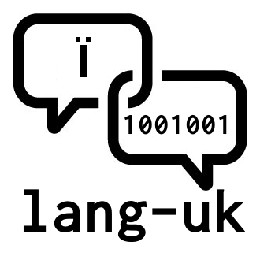

# Маніфест групи lang-uk

`lang-uk` — це неформальна група ентузіастів, які ставлять на меті покращення комп'ютерної обробки україномовних текстів.
Цей текст описує принципи, на яких будується робота групи.

1. Волонтерство

    Учасники групи працюють на волонтерських засадах, не розраховуючи на отримання за цю роботу винагороди.
Хоча для деяких проектів такий варіант не виключено, але це має обговорюватись окремо для кожного проекту.

2. Відкриті і загальнодоступні результати

    Результи роботи групи — це відкриті дані, програмний код інструментів роботи з ними, машинно-навчені моделі, публікації і т.і.
Всі ці артефакти мають публікуватись в центральному репозиторії групи (https://github.com/lang-uk),
мати дозволяючу ліцензію на роботу з ними (наприклад, MIT, BSD, Creative Commons, Apache). Ми намагатимемось забезпечити максимальну інтероперабельність рішень, побудованих на цих артефактах, на основі використання відкритих специфікацій, стандартних або загальноприйнятих форматів кодування даних і моделей.

3. Меритократія і демократичність

    В рамках окремих проектів рішення приймаються тими, хто бере на себе відповідальність за їх реалізацію.
В той же час, група є майданчиком для обговорень, які відбуваються прозоро, та прийняття спільних рішень щодо принципових напрямків роботи і підходів до реалізації конкретних проектів.

